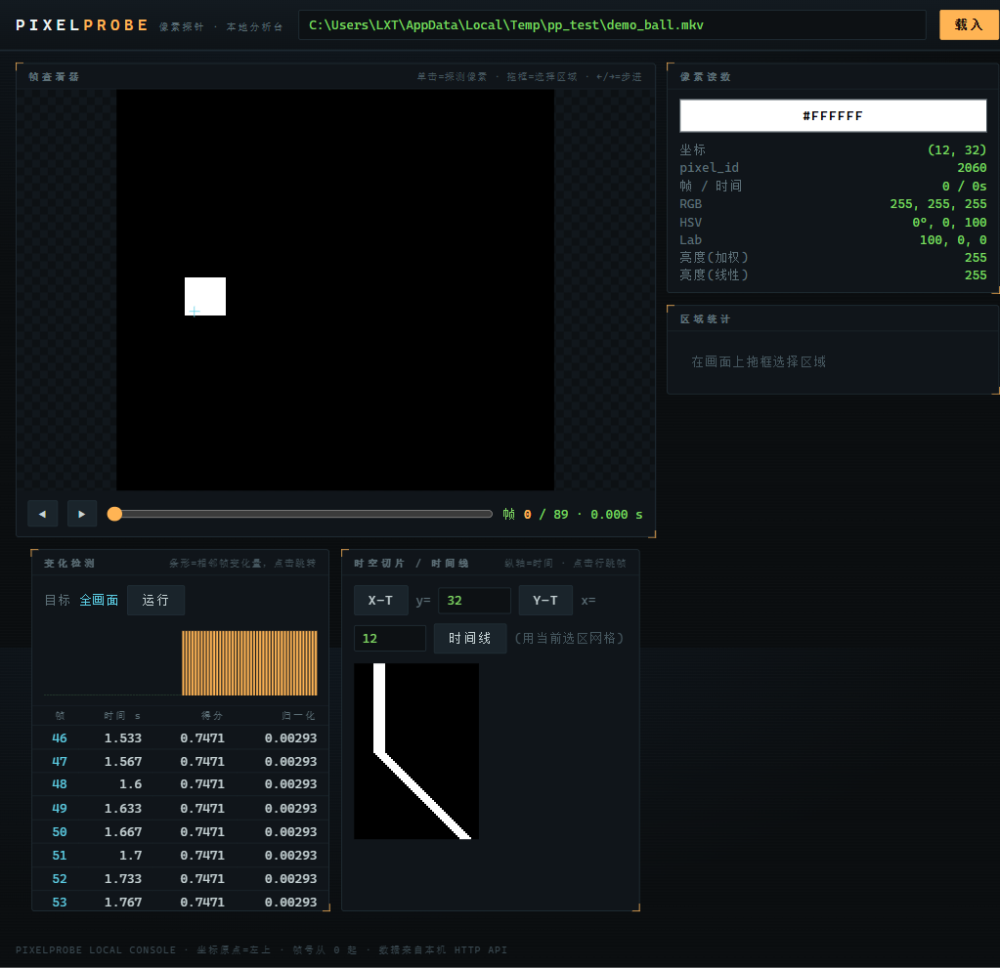

# PixelProbe

**让 AI 看懂画面，也让分析结果精确到帧、时间和像素。**

PixelProbe 是一款本地图片与视频分析工具。它可以快速定位视频中的关键变化、
提取指定画面、读取像素颜色、统计区域特征，并把长视频转换成便于观察的时间线
与时空切片。

它既可以作为可视化软件直接使用，也可以通过命令行完成批量分析，还可以作为
MCP 工具交给 AI 调用。媒体文件始终在本机处理。



## 主要功能

- **媒体信息**：查看尺寸、帧率、帧数、时长、编码和可变帧率信息。
- **精确取帧**：按帧号或时间提取画面，支持局部裁剪和预览缩放。
- **像素探测**：读取一个或多个像素的 RGB、HEX、HSV、Lab 和亮度。
- **区域分析**：统计选区的平均值、中位数、最值、标准差和颜色特征。
- **变化检测**：扫描点、区域或网格，找出变化最明显的帧和时间。
- **颜色时间线**：观察固定像素或网格区域在整段视频中的颜色变化。
- **X–T / Y–T 切片**：把空间与时间放在同一张图中，直观看到移动、闪烁和镜头变化。
- **AI 工具调用**：让支持 MCP 的 AI 自动选择分析步骤、查看关键帧并引用精确数据。

## 三种使用方式

| 方式 | 适合场景 | 启动命令 |
| --- | --- | --- |
| 可视化界面 | 手动浏览、点击像素、拖框分析、查看变化图表 | `pixelprobe-web` |
| 命令行 | 批量处理、脚本调用、导出 PNG/CSV/JSON | `pixelprobe` |
| MCP | 让 AI 自主分析本地图片和视频 | `pixelprobe-mcp` |

## AI 快速接入 MCP

最省事的方式是让 AI 客户端通过 `uvx` 直接从 GitHub 获取并运行 PixelProbe，
不需要先单独安装 PixelProbe。电脑上需要有
[uv](https://docs.astral.sh/uv/getting-started/installation/)。

Codex 用户只需执行：

```bash
codex mcp add pixelprobe -- uvx --from git+https://github.com/2061863797/PixelProbe.git pixelprobe-mcp
```

其他支持本地 stdio MCP 的 AI 客户端，可以复制下面的配置：

```json
{
  "mcpServers": {
    "pixelprobe": {
      "command": "uvx",
      "args": [
        "--from",
        "git+https://github.com/2061863797/PixelProbe.git",
        "pixelprobe-mcp"
      ]
    }
  }
}
```

首次调用时会从 GitHub 下载 PixelProbe 及其运行依赖，之后会使用本机缓存。
接入完成后，可以直接把本地媒体路径和问题交给 AI，例如：

> 分析 `D:\videos\test.mp4`，找出画面右上角第一次发生明显变化的准确帧号和时间。

AI 可以读取指定的本地图片和视频。只有名称含 `save` 的四个保存工具会写入文件，
并且必须由 AI 明确提供输出路径；其他工具只返回分析结果和预览图。

## 安装软件

需要 Python 3.11 或更高版本。优先支持 Windows 10/11，同时兼容 Linux 和 macOS。
从 GitHub 安装完整软件：

```bash
python -m pip install "git+https://github.com/2061863797/PixelProbe.git"
```

安装后会同时提供可视化界面、命令行和 MCP Server。可以先检查版本：

```bash
pixelprobe --version
```

如果软件已经安装，AI 客户端的 MCP 配置可以直接使用
`{"command": "pixelprobe-mcp"}`，无需再通过 `uvx` 下载。
`pixelprobe-mcp` 是由 AI 客户端启动的后台协议进程；直接在终端运行时会等待
AI 连接，不会出现交互界面。

## 可视化界面

运行：

```bash
pixelprobe-web
```

浏览器会自动打开 `http://127.0.0.1:8799/`。输入本地图片或视频路径后，可以：

- 播放视频、拖动时间轴、使用方向键逐帧查看；
- 单击画面读取像素颜色；
- 拖框选择区域并立即查看统计结果；
- 对选区执行变化检测，点击变化峰值跳转到对应帧；
- 查看颜色时间线和 X–T / Y–T 时空切片；
- 调整采样步长，在速度和精度之间切换。

可变帧率视频会使用真实逐帧时间进行定位。浏览器无法直接播放某种编码时，
界面会自动切换到后端单帧预览。

Web 服务只允许本机访问，不会监听 `0.0.0.0` 等外部地址。

## 命令行

常用示例：

```bash
# 查看视频信息
pixelprobe info input.mp4

# 提取第 120 帧
pixelprobe frame input.mp4 --frame 120 --output frame120.png

# 提取 3.5 秒处的画面并裁剪
pixelprobe frame input.mp4 --time 3.5 --crop 400,200,300,300 --output crop.png

# 查询两个像素
pixelprobe pixel input.mp4 --frame 120 --point 520,340 --point 600,400

# 分析矩形区域
pixelprobe region input.mp4 --frame 120 --rect 400,200,200,150

# 导出像素颜色时间线
pixelprobe timeline input.mp4 --point 520,340 --output timeline.png --csv timeline.csv

# 找出选区变化最大的 10 帧
pixelprobe changes input.mp4 --rect 400,200,200,150 --top 10
```

命令一览：

| 命令 | 功能 |
| --- | --- |
| `info` | 查看图片或视频信息 |
| `frame` | 按帧号或时间提取画面 |
| `pixel` | 查询一个或多个像素 |
| `region` | 分析矩形区域 |
| `timeline` | 生成像素颜色时间线 |
| `xt` | 生成水平扫描线的 X–T 切片 |
| `yt` | 生成垂直扫描线的 Y–T 切片 |
| `changes` | 定位变化最大的帧 |

所有命令均支持：

- `--json`：输出机器可读 JSON；
- `--quiet`：只显示必要结果；
- `--verbose`：显示详细错误信息；
- `--no-progress`：关闭进度条。

使用 `pixelprobe <命令> --help` 可以查看该命令的全部参数。

## AI 如何使用 PixelProbe

PixelProbe 可以通过 MCP 把媒体分析能力交给 AI。AI 负责理解问题和选择分析策略，
PixelProbe 负责返回精确的帧、时间、颜色和变化数据。

例如，当你询问“这个球从什么时候开始移动”时，AI 可以自动完成：

1. 读取视频信息；
2. 查看首帧并确定球的大致区域；
3. 扫描该区域的变化；
4. 提取变化点前后的关键帧；
5. 结合画面内容与精确时间给出答案。

MCP 提供媒体信息、取帧、像素、区域、时间线、时空切片和变化检测等只读工具。
需要写入文件时，AI 会使用独立的 PNG 保存工具，并明确提供输出路径；同名文件会被覆盖。

## 坐标与时间

- 坐标原点位于左上角，x 向右，y 向下；
- 所有坐标都对应原始媒体分辨率；
- 帧号从 `0` 开始；
- 帧范围包含起始帧和结束帧；
- 时间以媒体首帧为 `0` 秒；
- 按时间取帧时，选择时间戳不晚于目标时间的最后一帧；
- 可变帧率视频使用真实帧时间，不按平均帧率估算。

## 输入与输出

图片支持 PNG、JPEG、BMP、WebP 等常见格式。视频支持 MP4、MKV、AVI、MOV 等
常见容器，具体编码支持取决于本机的 FFmpeg/PyAV 环境。

分析结果可以输出为：

- PNG：帧、裁剪图、时间线和时空切片；
- CSV：像素时间线和逐帧变化记录；
- JSON：适合脚本和 AI 读取的结构化结果。

## 更多文档

- [API 参考](docs/api.md)
